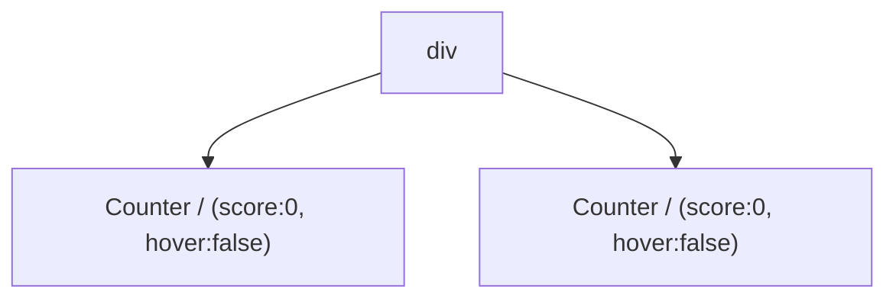

>[!Learning Goals]
> - How React "sees" component structures
> - When React chooses to preserve or reset the state
> - How to force React to reset component's state
> - How keys and types affect whether the state is preserved

- state는 component간에 분리되어있으며, react는 UI tree 상에서 component-state간 포함 관계를 tracking
## 1. UI tree에서의 위치(position) - React가 component structure를 파악하는 방법
- React는 JSX 기반으로 UI tree를 만들고, React DOM이 해당 UI tree와 일치하도록 브라우저 DOM을 업데이트
	- ![[react_managing-state_preserving-and-reset_01.png]]
- 🌟 위치 (position) 기반 파악
	- State는 컴포넌트 내부에 존재하는 것이 아니라 react에서 관리하기 때문에, 어떤 state가 어떤 component와 연결되어있는지를 react가 알아차려야 함
		- react에서는 component에 key가 존재하지 않는 이상 '위치'(배열 내 인덱스로 관리되는 듯?)를 가지고 항목의 정체성을 추적
	- ![[4) Preserving and Resetting State#🔅 `<Counter />` 예시 1 (코드) 카운터가 두개의 다른 위치에서 렌더링되는 경우]]
	- ![[4) Preserving and Resetting State#🔅 `<Counter />` 예시 1 (gram) 카운터가 두개의 다른 위치에서 렌더링되는 경우]]
		- 각 Counter component는 isolated state를 가짐 → counter가 개별적으로 동작
	- component가 화면에서 사라지는 순간 (렌더링이 중지된 순간) state는 사라지며, 해당 component를 다시 화면에 보일 때는 state가 초기화된다.

## 2. Position ↔︎ state & rendering
### 1. 같은 component가 같은 위치에 rendering되면 state는 유지된다
- ![[4) Preserving and Resetting State#🔅 `<Counter />` 예시 2 (코드) 동일한 위치의 동일한 컴포넌트]]
- 
	- 다른 위치에 있는 것 같지만 실제로는 위치가 동일함
		- JSX 마크업에서의 위치가 아니라 UI Tree상에서의 위치가 기준
		- React는 UI tree만 본다!
### 2. 다른 component가 같은 위치에 rendering 되면 state가 리셋된다
- ![[4) Preserving and Resetting State#🔅 `<Counter />` 예시 3 (코드) 동일한 위치의 다른 컴포넌트]]
- 
	- isPaused state에 따라 `<div>` 아래 자식의 태그가 변경되므로, UI tree도 변경된다.
	- 이에 따라 React는 Counter의 state를 리셋
### 3. component의 위치 뿐 아니라 렌더링된 tree의 구조가 이전 구조와 일치해야 state가 유지된다
- ![[4) Preserving and Resetting State#🔅 `<Counter />` 예시 4 (코드) 렌더링된 tree의 구조가 일치해야 state가 유지된다]]
-  
	- 최상위 div의 자손으로 동일하게 `<Counter />` 컴포넌트가 오지만, div의 직계자손이 각각 div와 section이기 때문에 isFancy의 값에 따라 렌더링되는 UI tree의 구조가 다르다.
	- 이런 경우에는 렌더링시 div와 section 이하를 제거했다가 다시 렌더링하기 때문에, `<Counter />` 컴포넌트도 재렌더링된다. 이에 따라 state 역시 재설정된다.
### 🔥 Component function 안에 다른 component function이 중첩되면 안되는 이유?
- ![[4) Preserving and Resetting State#🔅 선언이 중첩된 컴포넌트 예시]]
	- 위 예시에서는 MyComponent의 정의 안에 MyTextField의 정의가 중첩되어 있다.
	- = MyComponent를 렌더링하려 시도하는 과정에서 MyTextField는 언제나 새로운 함수로, 새로 생성된다.
		- 함수의 메모리 주소 면에서 생각해보면 ...
			- Javascript의 함수는 객체이다.
			- 따라서 함수는 메모리 내에서 고유한 주소를 갖는다.
			- MyComponent 내부에서 MyTextField를 정의할 때, MyComponent가 렌더링 될 때마다 MyTextField에 대한 새로운 함수 객체가 생성되고, 이는 이전 함수 객체와는 다른 새로운 메모리 주소를 갖는다.
		- Closure?
			- 함수가 정의될 때 정의된 환경의 lexical scope를 기억하게 된다.
			- MyComponent 내부에서 MyTextField를 정의했으므로 해당 MyTextField는 첫번째 MyComponent의 환경을 기억
			- MyComponent가 재렌더링된다면, MyTextField가 바인딩되는 환경도 새로운 MyComponent에 맞춰진다.
	- 따라서 Component 함수의 정의가 중첩되어 있을 때, 내포된 Component 함수는 언제나 새로운 Component로 간주될 수 밖에 없다.
- ==내포한 Component가 재렌더링 될 때마다 내포된 Component가 가지고 있던 state가 초기화된다.==
- ==버그 & 성능 문제가 생길 가능성==


## 3. 동일한 UI tree 상에서 state 재설정하기
### 1. 다른 위치에서 컴포넌트 렌더링하기
- ![[4) Preserving and Resetting State#🔅다른 위치에서 컴포넌트 렌더링 예시 - 개별 논리연산자 사용]]
	- 위 예시는 2개의 서로 다른 조건부 렌더링이 존재
		- React에서 component 및 요소의 배열을 렌더링시 각 항목의 위치가 해당 항목의 identity를 결정하는 중요 요소로, key 속성이 제공되지 않을 경우에는 기본적으로 위치를 기반으로 identity 추적
		- 이 경우 둘 중 하나는 '존재하지 않는 상태'이고, 나머지 `<Counter />`만 렌더링됨
			- '존재하지 않는 상태' 역시 리스트의 한 항목으로 간주
			- if ~ else 또는 삼항연산자로 조건에 따라 한 가지 케이스만 렌더링되는 경우와 다르게 간주됨
		- 
	- ==따라서 이 경우 `<Counter />`가 렌더링 될 때마다 state가 초기화됨 (삼항연산자 사용 케이스와는 달리!)==
### 2. key로 state 재설정하기
- Component를 구분하기 위해 key 사용
- ![[4) Preserving and Resetting State#🔅 key를 추가해 컴포넌트 구분 예시]]
	- UI tree 내에서 위치가 같음에도 `<Counter />`를 전환할 때마다 state가 재설정됨
	- key가 지정되면 부모 내 순서 대신 key 자체를 위치의 일부로 사용하므로, 같은 위치에 있어도 다른 component가 됨
		- 단, key는 전역으로 작동하지 않으며 부모 내에서의 위치만을 알려줌
## 4. 제거된 component의 state 보존하기
- Ex) 채팅방 - 서로 다른 사용자와의 대화이지만 이전 대화를 볼 수 있어야 함
	1. 모든 채팅을 렌더링하되 CSS로 비해당 채팅을 숨기기
		1. 구조가 간단한 경우라면 괜찮지만, 숨겨진 tree가 늘어날 수록 느려짐
	2. 입력 대기중인 모든 메시지를 부모 컴포넌트에서 state로 관리
		1. 자식 Component가 지워져도 데이터는 부모가 가지고 있으므로 안전
	3. React state 외의 방법 사용
		- ex) LocalStorage
- 어떤 방법을 사용하더라도, 컴포넌트 구분과 연관된 사용자 전환 케이스에 대해서는 id를 이용해 key와 연결하는 것이 일반적
## ----- Example list -----
#### 🔅 `<Counter />` 예시 1 (코드) : 카운터가 두개의 다른 위치에서 렌더링되는 경우
```javascript
// UI tree만을 비교하기 위해 예시를 간략화함
import { useState } from "react"

export default function App() {
	return (
		<div>
			<Counter />
			<Counter />
		</div>
	)
}
```
#### 🔅 `<Counter />` 예시 1 (gram) : 카운터가 두개의 다른 위치에서 렌더링되는 경우

#### 🔅 `<Counter />` 예시 2 (코드) : 동일한 위치의 동일한 컴포넌트
```javascript
// UI tree만을 비교하기 위해 예시를 간략화함
import { useState } from "react"

export default function App() {
	const [isFancy, setIsFancy] = useState(false)
	return (
		<div>
			{ isFancy ? (
				<Counter isFancy={true} />
			) : (
				<Counter isFancy={false} />
			)}
			...
		</div>
	)
}
```
#### 🔅 `<Counter />` 예시 3 (코드) : 동일한 위치의 다른 컴포넌트
``` javascript
// UI tree만을 비교하기 위해 예시를 간략화함
import { useState } from 'react';

export default function App() {
  const [isPaused, setIsPaused] = useState(false);
  return (
    <div>
      {isPaused ? (
        <p>See you later!</p> 
      ) : (
        <Counter /> 
      )}
      ...
    </div>
    )
}
```
#### 🔅 `<Counter />` 예시 4 (코드) : 렌더링된 tree의 구조가 일치해야 state가 유지된다
```javascript
// UI tree만을 비교하기 위해 예시를 간략화함
import { useState } from 'react';

export default function App() {
  const [isFancy, setIsFancy] = useState(false);
  return (
    <div>
      {isFancy ? (
        <div>
          <Counter isFancy={true} /> 
        </div>
      ) : (
        <section>
          <Counter isFancy={false} />
        </section>
      )}
    ...
    </div>
    )
}
```
#### 🔅 선언이 중첩된 컴포넌트 예시
```javascript
import { useState } from 'react';

export default function MyComponent() {
  const [counter, setCounter] = useState(0);

  function MyTextField() {
    const [text, setText] = useState('');

    return (
      <input
        value={text}
        onChange={e => setText(e.target.value)}
      />
    );
  }

  return (
    <>
      <MyTextField />
      <button onClick={() => {
        setCounter(counter + 1)
      }}>Clicked {counter} times</button>
    </>
  );
}
```
#### 🔅다른 위치에서 컴포넌트 렌더링 예시 - 개별 논리연산자 사용
```javascript
// UI tree만을 비교하기 위해 예시를 간략화함
import { useState } from 'react';

export default function Scoreboard() {
  const [isPlayerA, setIsPlayerA] = useState(true);
  return (
    <div>
      {isPlayerA &&
        <Counter person="Taylor" />
      }
      {!isPlayerA &&
        <Counter person="Sarah" />
      }
      ...
    </div>
    )
}
```

#### 🔅 key를 추가해 컴포넌트 구분 예시
``` javascript
import { useState } from 'react';

export default function Scoreboard() {
  const [isPlayerA, setIsPlayerA] = useState(true);
  return (
	    <div>
	      {isPlayerA ? (
	        <Counter key="Taylor" person="Taylor" />
	      ) : (
	        <Counter key="Sarah" person="Sarah" />
	      )}
	    ...
	    </div>
    )
}
```